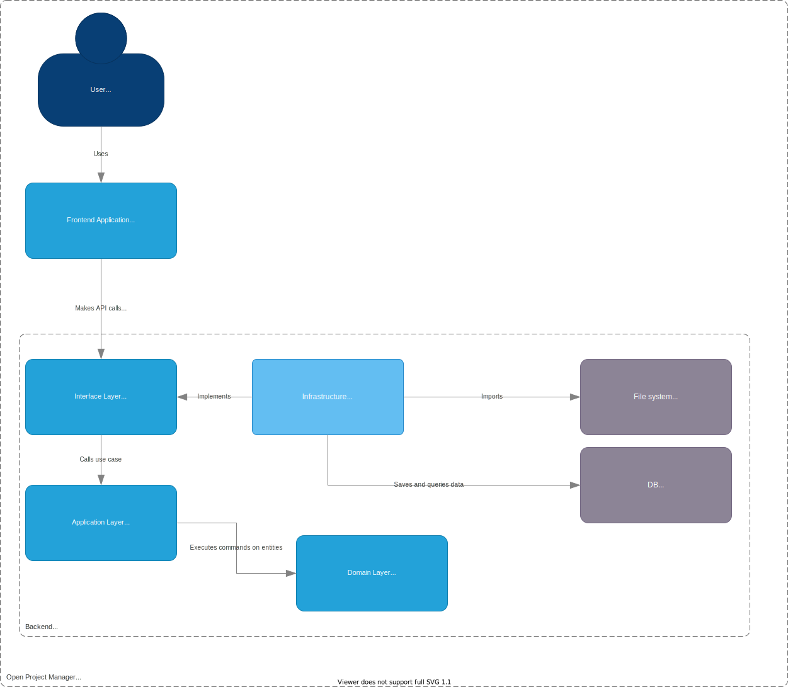

# Open Project Manager

---

[toc]

---

## Introduction

**Open Project Manager** is yet another [open-source](https://en.wikipedia.org/wiki/Open_source) [project management software](https://en.wikipedia.org/wiki/Project_management_software). In this document, Open Project Manager will be referred to as "the system".

### Purpose

This is my attempt to create a useful to tool to suit my needs and preferences for gaining overview of a project. This project consists of a backend web application, a frontend web application, and some shared configuration and documentation.

### Intended Audience

* Myself
* People who would like to host or run locally their own project management tool for personal use
* People interested in looking at an open-source implementation of a project management tool

### Project Scope

### Definitions, Acronyms and Abbreviations

* **Clean Architecture**
* **device** - Any type of electronic device capable of using the system via its UI (a device is usually a web browser on a phone or computer).
* **domain** - A core business representation at the heart of the system, this is a pure business representation on top of which the rest of the system is built. The domain has no external dependencies.
* **"the project"** - The entire project, including all code and documentation.
* **"the system"** - The frontend and backend web applications, including all functionality contained within them.
* **UI** - User Interface, the graphical interface that a user interacts with on a device when they use the system.
* **user** - A person who uses the system.

### References

1. [GDPR - General Data Protection Regulation](https://gdpr-info.eu/)

### Document Overview

## System Overview

> This section describes the general factors that affect the system and its requirements. This section does not define specific requirements, it only provides a background for requirements.

### System Perspective

### System Functions

### System Constraints

### User Characteristics

### Assumptions and Dependencies

> This section lists any assumed factors (as opposed to known facts) that could affect the requirements stated in the SRS.

## Requirements

### External Interface Requirements

> This subsection defines all the inputs into and outputs requirements of the system.

#### User Interface Requirements

> Requirements relating to user interfaces, i.e. interfaces where a user interacts with the system. This section describes the layout, features, and components of the system. The focus in on overall shared UI rules and designs, while specific implementations are handled on the level of functional requirements.

##### Overall User Interface Requirements

Requirement | Source   | Destination | Type   | Description
------------|----------|-------------|--------|----------------------------------------------------------------------------------
UIREQ-001   | Frontend | User        | Output | The system's UI outputs visual information to the user via a web application GUI.
UIREQ-002   | User     | Frontend    | Input  | A user can input data to the system via a web application GUI.

The UI layer of the system.

##### Layout Requirements

##### Features Requirements

This section describes the various features of the UI. Each feature is a page or a group of pages that share a common sub-layout, purpose, and view model.

###### Authentication

###### Dashboard

###### List

###### Board

###### Roadmap

###### Story Map

###### Sprint Report

#### Hardware Interface Requirements

#### Software Interface Requirements

Interface Provider | Interface User | Direction
-------------------|----------------|----------
Database           | Backend        | Single

Source  | Destination | Type
--------|-------------|---------
Backend | Database    | Internal

#### Communication Interface Requirements

> This section describes the requirements associated with any communications functions required by this product, including e-mail, web browser, network server communications protocols, electronic forms, and so on.

1. Communication between user client and the Web Application API will follow these rule:
   1. Use HTTPS
   2. API calls may use URL parameters
   3. Request payloads can contain data. If it does, it must be in JSON format
   4. Response payloads must be in JSON format
2. Communication between the user client and the Web Application Frontend must follow these rules:
   1. Use HTTPS

None.

### Functional Requirements

> This section describes the functional requirements of the system.

1. Project
   1. Site owners and site administrators and full site users can create a project
   2. Project owners and administrators can update a project
   3. Project owners and administrators can delete a project
2. Issues
   1. Users can view issues
   2. Users can create issues
   3. Users can update issues
   4. Users can delete issues
   5. Users can change issue relations on an issue
      1. Users can add an issue relation
      2. Users can update an issue relation
      3. Users can delete an issue relation
      4. When adding an issue relation, a user can search for issue key or title to select the related issue
      5. Users can click on an issue relation to see the related issue
      6. Issue relations are displayed on both issues in a relation
3. Issue Types
   1. Users can view a list of issue types on a project
   2. Users can view an issue type
   3. Users can update an issue type
   4. Users can delete an issue type
   5. Users can create an issue type
4. Statuses
5. Issue Filter
   1. Users can filter a view of issues
   2. Users can order issues by an issue attribute in ascending or descending order
   3. The state of an issue filter is encoded in the URL parameters
6. Issue List
   1. Users can view a list of issues in a project
   2. Users can click on issues in an issue list to view them
   3. Users can filter an issue list
7. Board
   1. Users can view a board of issues
   2. Users can filter a board
   3. Users can change what attribute is displayed as swimlane
   4. Users can change what attribute is displayed as column
8. Storymap
   1. Users can view a storymap
   2. Users can filter a storymap
9. Roadmap
    1. Users can view a roadmap
    2. Users can filter a roadmap

### Non-functional requirements

> This section states additional, quality-related property requirements that the functional effects of the software should present.

#### Performance Requirements

> Performance requirements for the product under various circumstances are stated here.

#### Safety Requirements

#### Security Requirements

* [ ] **SECREQ-001**: Passwords must be hashed and salted when stored. Consequently, passwords must _never_ be stored in plaintext.
* [ ] **SECREQ-002**: The system must not transmit any data to any third party outside the system.
  * Thus, any software libraries that transmit data to third parties are disallowed from use in the system.
  * Exceptions to this is transmission of data to an electronic device and software that is used as a client by a user of the system.

#### Reliability Requirements

#### Software Quality Attributes

### Compliance Requirements

> This section describes requirements regarding compliance with laws and regulations.

* [ ] **COMPREQ-001**: The system must be _GDPR_ compliant.
  * [ ] **COMPREQ-001.001**: _Right of access_. The system must be able to comply with _Article 15_ of the _GDPR_. Therefore, it must be possible in the system to obtain all personal data of a user. This could be used to satisfy a request from a user to provide information about all their personal data that the system contains.
  * [ ] **COMPREQ-001.002**: The system must comply with _Article 12_ of the _GDPR_. Therefore, it must be documented how personal data is used by the system.
  * [ ] **COMPREQ-001.003**: _Right of ersure_. The system must be able to comply with _Article 17_ of the _GDPR_.
* [ ] **COMPREQ-002**: The system must clearly state in a _Terms of Service_ to any user signing up to use the system, before they complete the signup process, that no unlawful content must be inputted to the system by the user via any means the user has to interface with the system.

## Domain

> This section describes the system from a business domain perspective.

The domain contains _aggregates_, _entities_, and _value objects_.

### List of domains

#### Project Domain

The **Project** domain is concerned with creating and modifying projects and enforcing that a project contains the data that it must.

#### Issue Domain

The **Issue** domain is about modifying individual issues within the context of their project.

The Issue domain contains the following aggregates:

* `IssueInProjectAggregate`

The Issue domain contains the following entities:

* `Project`
* `Issue`
* `IssueType`
* `IssueRelation`
* `IssueStatus`
* `User`

A `Project` contains other `Issues`, possible `IssueTypes` to choose from, possible `IssueRelations`, `IssueStatuses`, and `Users` who belong to that project. Modifying, creating, or deleting an `Issue` is bounded by the constraints imposed by which of these other entities exist on the `Project`. The `IssueInProjectAggregate` unifies all of these entities together in an aggregate, which is the full context needed in order to be able to perform any operations on an `Issue`.

#### User domain

The **User** domain handles the business logic for users.

A user can have the following global types (unconnected to a specific project):

* **Site Owner** (they have all permissions)
* **Site Admin** (they can suspend, unsuspend, and delete other users)
* **Full User** (they can create projects, and update or delete projects they have created)
* **User** (they can only view and be active in projects in which they have a role)

## Architecture

> This section describes the software architecture of the system. Note that this is _not_ a description of specific technologies and frameworks.

The architecture of the system will adhere to these ideas and principles:

* [Clean Architecture](https://blog.cleancoder.com/uncle-bob/2012/08/13/the-clean-architecture.html)
  
* [Screaming Architecture](https://blog.cleancoder.com/uncle-bob/2011/09/30/Screaming-Architecture.html) (architecture should tell readers about the system and its use cases and domain, not about the frameworks used in it)

_Figure: C4 Architectural Overview Model_

## Database Schema

> This section describes the tables, views and relations in the system's database(s).

### Database Tables

_Figure: Database Schema_

### Database Views

## Technology

### Frontend technologies

* **TypeScript** (programming language, picked to ensure type safety during development)
* **React** (main UI library)
* [Create React App](https://create-react-app.dev) (setup application skeleton)
* [React Query](https://tanstack.com/query/v4/docs/overview) (fetching and updating data from the server)
* **react-router-dom** (routing)
* **sass** (CSS pre-processing)

### Backend technologies

* **Node.js** (runtime environment)
* **TypeScript** (programming language, ensures type safety, uses same language as frontend to simplify workflow)
* **NestJS** (with Express.js, main backend framework)
* **SQLite** (database)

## Infrastructure

## How to use

This section contains guides for how to use the application from the perspective of deployment, maintenance, and end-user usage.

### Deployment guide

### Maintenance guide

### User guide

## Contributors

* [Adrian Hansson](github.com/adrian-hansson/)

## License

See [LICENSE.txt](LICENSE.txt).
